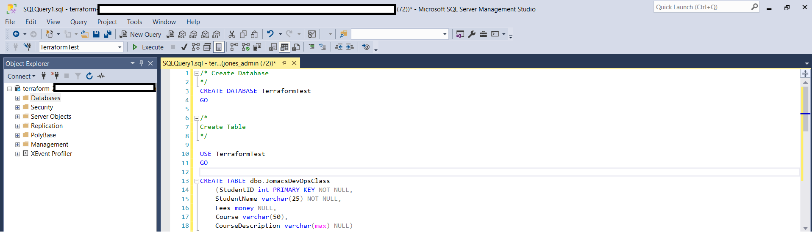

# Terraform RDS Setup
This Terraform configuration sets up an RDS instance with a MSSQL and MySQL databases.

It also sets up a VPC, Subnet, Security Group and allowing inbound and outbound traffic.

## Terraform configurations
This Terraform configuration consists of the following files:
- `main.tf`: This is the main Terraform configuration file that defines the resources to create.
- `variables.tf`: This file defines the input variables for the Terraform configuration.
- `output.tf`: This file defines the output values of the Terraform configuration.
- `Provider.tf`: This file specifies the Terraform version and the AWS provider version.
- `RDS.tf`: This file defines the RDS instance and database configurations.

### Deploying Resources
To deploy the resources, follow these steps:
1. Install Terraform on your local machine if you haven't already.
2. Initialize Terraform by running `terraform init`.
3. Run `terraform plan` to populate the resources to be created.
4. Run `terraform apply` to create the resources.
- Plan and Apply Secrets

### Confirm Secrets Creation
After running `terraform apply`, we can confirm that the resources have been created by checking the AWS Management.
Equally, we can also check the Terraform state file (`terraform.tfstate`) to see the created resources.

- Secrets created: 

Terraform state list after applying secrets:

- Plan and Apply RDS

- Applied plan

### Coonect MSSQL Locally 
- Install SQL Server Management Studio (SSMS) on your local machine.
- Connect to the RDS instance using the endpoint, username, and password.
- Create a new database connection in SSMS.
- Enter the RDS instance endpoint, username, and password.
- Click "Connect" to establish the connection.

- Create a new query to test the connection.

- Run the query to test the connection.

5. Run `terraform destroy` to delete the resources when you're done.

**N/B**: I have excluded the file, `terrform.tfvars`, containing the secrets when I pushed the files to the repo. 